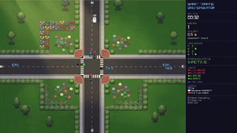

# 🚦 Smart Traffic Grid Simulator

A real-time **C++ traffic intersection simulator** built with **Raylib** that models adaptive traffic signal timing, emergency vehicle priority dispatch, and intelligent traffic flow management.

##  Overview

Traditional traffic signals often rely on fixed timers, regardless of how much traffic is actually present.

This project simulates a smarter alternative by dynamically responding to traffic conditions at an intersection.

The system:

* Tracks traffic queues in each direction
* Adjusts green-light duration based on traffic demand
* Prioritizes emergency vehicles
* Creates a clear path for ambulances and fire trucks
* Prevents conflicting traffic flows inside the intersection
* Reacts to traffic changes in real time

##  Key Features

### 🟢 Adaptive Traffic Signal Timing

The simulator dynamically adjusts green-light duration based on the number of vehicles waiting in each direction.

* Busy lanes receive longer green times
* Empty lanes receive shorter green times
* Green-light duration dynamically ranges from approximately **3 to 12 seconds**
* Traffic queues are recalculated continuously

This prevents vehicles from waiting unnecessarily at empty intersections.

### 🚑 Emergency Vehicle Priority

Emergency vehicles receive priority through a binary-heap priority queue.

Supported emergency vehicles include:

* 🚑 Ambulances
* 🚒 Fire trucks

When an emergency vehicle approaches:

1. It registers with the emergency priority queue.
2. The highest-priority emergency vehicle is identified.
3. The traffic signal system overrides normal timing.
4. Conflicting directions are stopped.
5. The emergency vehicle receives a clear path.
6. Normal traffic signal cycling resumes after the vehicle clears the intersection.

### 🚘 Intelligent Lane Clearing

Regular vehicles detect approaching emergency vehicles and move aside to create a path.

This simulates real-world traffic yielding behavior and allows emergency vehicles to pass through the intersection more efficiently.

### 🛡️ Intersection Safety

The simulator tracks whether traffic is currently occupying the intersection.

This helps prevent conflicting traffic flows from entering the intersection at the same time.

##  System Architecture

| Problem                    | Solution                           | Core Components                    |
| -------------------------- | ---------------------------------- | ---------------------------------- |
| Unnecessary waiting        | Demand-based green-light timing    | `LaneQueue`, `IntersectionManager` |
| Emergency vehicle blockage | Priority queue and signal override | `EmergencyPQ`, `Vehicle`           |
| Traffic overload           | Continuous adaptive timing         | `IntersectionManager`              |
| Conflicting traffic flows  | Intersection occupancy tracking    | `boxOccupancy`                     |
| Signal state management    | Traffic-light state machine        | `TrafficLight`                     |

##  Core Components

### `LaneQueue`

Tracks the number of vehicles waiting in each direction.

### `IntersectionManager`

Controls:

* Traffic signal timing
* Queue-based green-light allocation
* Emergency overrides
* Intersection occupancy
* Traffic flow management

### `EmergencyPQ`

A priority queue implemented using a binary heap to manage emergency vehicles based on priority.

### `Vehicle`

Represents regular and emergency vehicles and manages their movement through the intersection.

### `TrafficLight`

Controls traffic-light states and signal behavior.

##  Controls

| Key   | Action                           |
| ----- | -------------------------------- |
| `E`   | Spawn a random emergency vehicle |
| `C`   | Spawn a regular car              |
| `ESC` | Quit the simulator               |

##  Technologies Used

* **C++**
* **Raylib**
* Object-Oriented Programming
* Binary Heap / Priority Queue
* Real-time simulation
* Dynamic traffic management
* Collision and occupancy detection

##  Concepts Demonstrated

This project applies several important programming and computer science concepts:

* Object-Oriented Programming
* Classes and objects
* Priority queues
* Binary heaps
* Real-time simulation
* Queue management
* State machines
* Collision detection
* Dynamic resource allocation
* Event-driven behavior
* Algorithmic decision-making

##  How to Run

### Prerequisites

Make sure you have:

* A C++ compiler
* Raylib installed and configured

### Compile

Compile the source code with your preferred C++ compiler and link it with Raylib.

The exact command depends on your operating system and Raylib configuration.

### Run

After compiling the project, run the generated executable.

##  Current Limitation

The current simulator switches traffic signals immediately when an emergency vehicle is detected.

A real-world implementation would require a safer transition system, such as:

* Warning signals
* Flashing indicators
* Yellow-light transitions
* All-red safety intervals
* Sensor-based emergency vehicle detection

This would provide a safer transition for vehicles already inside or approaching the intersection.

##  Future Improvements

Possible future improvements include:

*  Realistic yellow-light transition periods
*  Siren-based emergency vehicle detection
*  Traffic analytics and statistics
*  Multiple connected intersections
*  More realistic vehicle behavior
*  Traffic-density visualization
*  Emergency vehicle detection sensors
*  Networked traffic simulation

##  Author

**Syeda Hira Batool**

GitHub: [@syeda-hira-batool](https://github.com/syeda-hira-batool)
